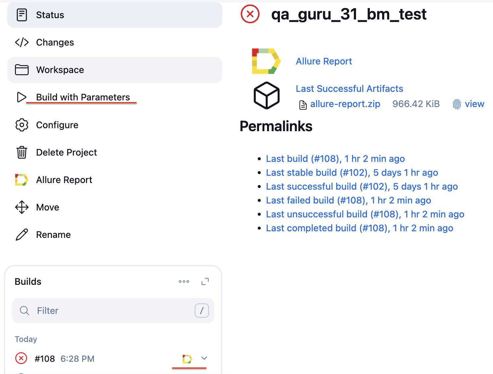
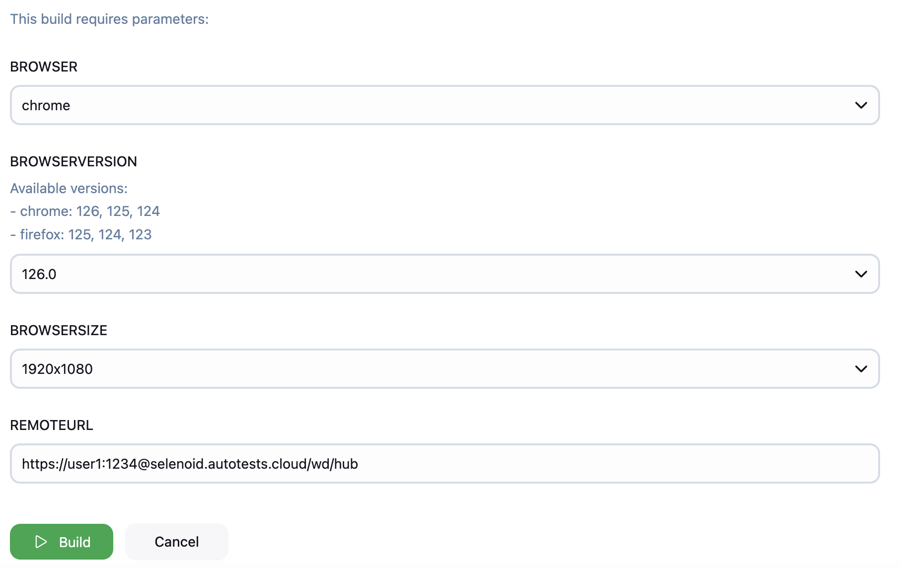
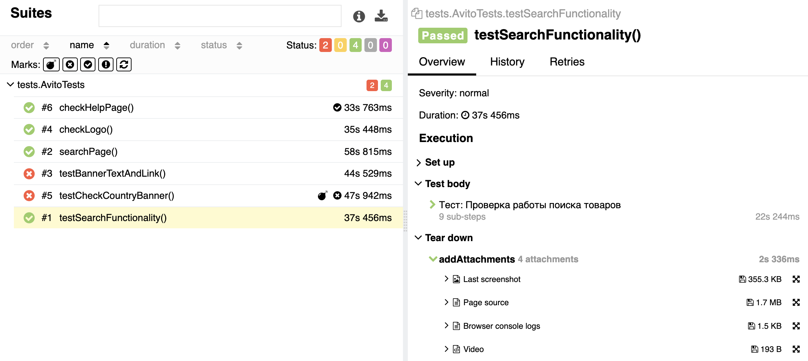
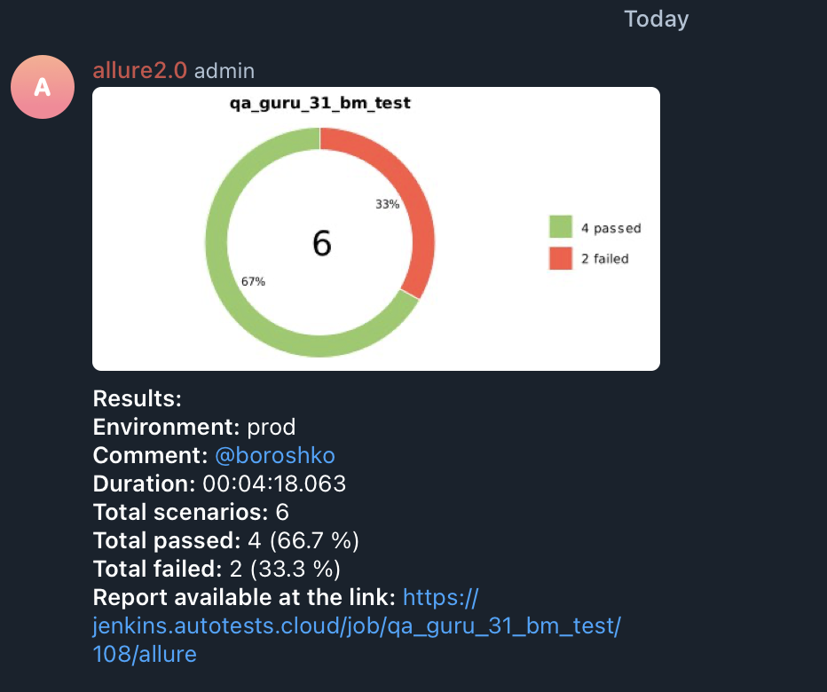

# 🎮 Проект по автоматизации тестовых сценариев для сайта компании

## 🧑‍💻Тест-кейсы
- Главная страница:
  - [x] Проверка логотипа
  - [x] Проверка баннера и элементов навигации
- Страница поиска:
  - [x] Выполнение поиска товара и проверка результатов
  - [x] Открытие карточки товара и валидация названия и цены
- Страница помощи:
  - [x] Проверка работы раздела "Помощь"
  - [x] Валидация поиска по разделу "Помощь"
  - [x] Проверка отображения раздела помощи в новой вкладке

# 💻 Используемые инструменты

  <code></code>
  <code></code>
  <code></code>
  <code></code>
  <code></code>
  <code></code>
  <code></code>
  <code></code>
  <code></code>
  <code></code>
<!--   <code></code> -->
  <code></code>

+ **Java** – основной язык программирования проекта.
+ **Selenide** – фреймворк для написания автоматизированных тестов.
+ **JUnit 5** – фреймворк для организации и запуска тестов.
+ **Gradle** – система сборки проекта.
+ **Jenkins** – инструмент для запуска тестов в CI/CD.
+ **Selenoid** – запуск браузеров в Docker-контейнерах.
+ **Allure Report** – визуализация результатов тестирования.
+ **Telegram API** – получение финального отчёта через Telegram-бот.

# 🚀 Как запустить тесты 

### Локальный запуск через командную строку
**Важно:** По умолчанию тесты запускаются с такими параметрами (при необходимости их можно изменить в файле `src/test/resources/remote.properties`):
+ Браузер: **Google Chrome**
+ Версия браузера: **126.0**
+ Размер окна: **1920x1080**

### Запуск через  [Jenkins](https://jenkins.autotests.cloud/job/qa_guru_31_bm_test/build?delay=0sec)

> Доступ к Jenkins: admin@qa.guru

Тесты в Jenkins запускаются со следующими параметрами по умолчанию:
+ Browser: **Google Chrome**
+ Browser version: **126.0**
+ Browser size: **1920x1080**

Для запуска тестов через Jenkins используйте [job](https://jenkins.autotests.cloud/job/qa_guru_31_bm_test/build?delay=0sec), Окружение настроено для русского языка, поэтому для запуска нажмите на кнопку со стрелкой :arrow_forward:.
Результаты можно посмотреть через Allure Report

The following page will open. You can keep the default credentials and press the indicated button directly.

### Список тестов с описанием шагов и визуализацией результатов
На данной странице представлен стандартный набор тестов, сгруппированный по юзер-стори и тестовым наборам.

  

### Пример видео-приложения
There's a video attachment for each test available.

  

### Пример уведомления в Telegram

